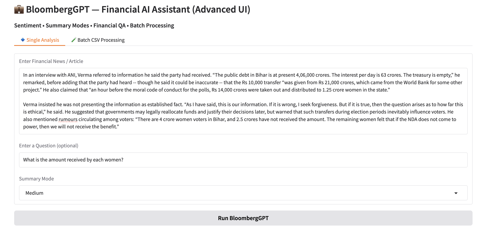

# 💼 Financial NLP Assistant


## 🚀 Overview

**Financial NLP Assistant** is a BloombergGPT-inspired AI system designed to analyze and understand financial text using state-of-the-art NLP models.

It combines multiple domain-specific models to deliver:

* 📊 Financial Sentiment Analysis
* 📝 Financial Summarization
* ❓ Context-Aware Question Answering
* 📂 Batch CSV Processing
* 🌐 Interactive Web UI (Gradio)

This project demonstrates how large language models can be applied to real-world financial data for extracting actionable insights.

---

## 🎯 Problem Statement

Financial text such as earnings reports, news articles, and analyst commentary is complex and context-heavy.

Traditional NLP systems struggle with:

* Domain-specific sentiment understanding
* Long-form summarization
* Context-aware reasoning
* Consistent and reproducible outputs

This project addresses these challenges using a modular pipeline inspired by BloombergGPT.

---

## 🧠 Models Used

| Task               | Model               |
| ------------------ | ------------------- |
| Sentiment Analysis | FinBERT             |
| Summarization      | PEGASUS (Financial) |
| Question Answering | FLAN-T5             |

---

## ⚙️ Features

* ✅ Domain-specific financial NLP pipeline
* ✅ Multi-model integration (FinBERT + PEGASUS + FLAN-T5)
* ✅ Clean and reproducible outputs
* ✅ Batch processing using CSV files
* ✅ Interactive UI using Gradio
* ✅ Real-world financial text testing

---

## 🏗️ System Pipeline

1. Input financial text (+ optional question)
2. Sentiment analysis
3. Financial summarization
4. Question answering
5. Structured output generation

---

## 📊 Sample Output

Example:

* **Sentiment:** Positive (0.98)
* **Summary:** AI demand significantly boosted Nvidia’s revenue growth
* **Answer:** Revenue increased due to strong demand for AI GPUs

📁 Full results available in:
`sample_results.csv`

---

## 🖼️ Demo


```markdown

```

---

## ⚙️ Installation

```bash
pip install -r requirements.txt
```

---

## ▶️ Run the Project

### Run Notebook (Development)

```bash
jupyter notebook
```

### Run UI (Recommended)

```bash
python app.py
```

---

## 📂 Project Structure

```
financial-nlp-assistant/
│
├── main.ipynb        # Full development notebook
├── pipeline.py       # Core NLP pipeline
├── app.py            # Gradio UI
├── sample_results.csv
├── README.md
├── requirements.txt
```

---

## ⚠️ Limitations

* Not trained on proprietary Bloomberg data
* Depends on pre-trained models
* Performance limited by model inference speed

---

## 🔮 Future Improvements

* Real-time financial data integration
* Retrieval-Augmented Generation (RAG)
* Trading signal generation (BUY/SELL)
* Deployment as a web application

---

## 📄 Disclaimer

This is an academic project inspired by BloombergGPT and does not use proprietary datasets or models.

---

## 👨‍💻 Author

**Puneet Devnani**
